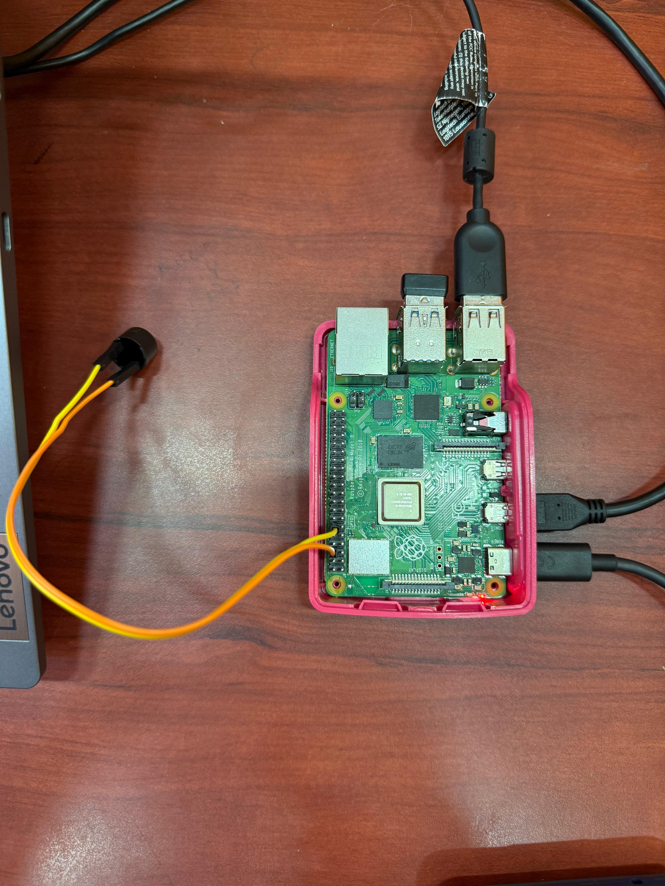

# Driver Drowsiness Detection System

Real-time driver drowsiness detection using **Eye Aspect Ratio (EAR)** computed from **MediaPipe** facial landmarks, with a **hardware buzzer alarm** on a **Raspberry Pi**. It detects both prolonged eye closure *and* loss of the driver's face (head-drop / looking away), and sounds an alarm — aligned with **UN SDG 3: Good Health & Well-being** by helping reduce fatigue-related road accidents.


https://github.com/user-attachments/assets/9765105f-0d67-4f61-bf8f-0832f74f8434

## The story: why this is a v2

This project began as a team coursework submission, where my contribution was the documentation. That first version used **Haar Cascade classifiers**, and its core logic was essentially: *"if I can't find an eye-shaped blob, the eyes must be closed → drowsy."*

The problem: a turned head, poor lighting, or a blurry frame **also** produce no blob — none of which mean the driver is asleep. So it false-alarmed constantly. It was detecting the *absence of a feature*, not the actual state of the eyes.

I rebuilt the **entire detection pipeline from scratch, independently**, around a method that measures whether the eyes are genuinely open rather than guessing from blob detection.

| | v1 (original) | v2 (this rebuild) |
|---|---|---|
| Method | Haar Cascade — "is there an eye blob?" | Eye Aspect Ratio from facial landmarks |
| Failure mode | False alarms on head turns / lighting | Measures real eyelid geometry |
| Threshold | Fixed, ~6.5 s (too slow to matter) | Auto-calibrated per user, ~2 s |
| Hardware | — | Raspberry Pi + GPIO buzzer |

---

## How it works

A face-landmark model (MediaPipe FaceLandmarker) marks points around each eye every frame. From six points per eye, the program computes the **Eye Aspect Ratio (EAR)**:

> **EAR = (vertical eyelid gap) ÷ (horizontal eye width)**

Because it's a *ratio*, it stays stable regardless of distance from the camera. Open eyes give a high EAR (~0.3); closed eyes drop it near zero. The logic:

1. **Calibrate** — on startup, measure the user's own open-eye EAR for a few seconds and set a *personal* threshold. No hard-coded magic number.
2. **Time it** — a brief dip below threshold is just a blink, so it's ignored. Only EAR staying below threshold for ~2 continuous seconds counts as drowsy.
3. **Alarm** — trigger the buzzer and an on-screen warning. The same time-based logic also fires if the **face is lost** for 2 seconds (head drop / looking away).

---

## Features

- Eye Aspect Ratio detection via MediaPipe facial landmarks (not unreliable blob detection)
- Per-user auto-calibration at startup
- Blink filtering via a time threshold — no false alarms on normal blinks
- Secondary alarm on face loss (head-drop / driver looking away)
- Hardware buzzer alarm over GPIO on Raspberry Pi
- Runs on a laptop (visual only) **or** a Raspberry Pi (visual + buzzer)

---

## Tech stack

**Python** · **OpenCV** · **MediaPipe (Tasks API — FaceLandmarker)** · **gpiozero** (GPIO control) · **Raspberry Pi 4B**

---

## Hardware

- Raspberry Pi 4B
- USB webcam
- Passive buzzer: **(+) → GPIO 18**, **(−) → GND**



---

## Setup

1. Clone the repo and enter it:
   ```bash
   git clone https://github.com/soumyachhablani/Drowsiness-Detection-System.git
   cd Drowsiness-Detection-System
   ```
2. Create a virtual environment (Python **3.9–3.12** — MediaPipe does not yet support 3.13) and install dependencies:
   ```bash
   python3 -m venv venv
   source venv/bin/activate          # Windows: venv\Scripts\activate
   pip install -r requirements.txt
   ```
3. Download the MediaPipe face-landmark model into the project folder:
   ```bash
   curl -o face_landmarker.task https://storage.googleapis.com/mediapipe-models/face_landmarker/face_landmarker/float16/1/face_landmarker.task
   ```
4. Run it:
   ```bash
   python drowsiness_detector.py
   ```
   Keep your eyes open during the ~5-second calibration, then it monitors live. Press `q` to quit.

> On a laptop with no buzzer it runs in visual-only mode automatically; on a Raspberry Pi it also drives the buzzer over GPIO.

---

## Limitations (honest notes)

- Very low light or heavy glare on glasses can reduce landmark accuracy.
- EAR detects *eye closure*, a strong but incomplete proxy for drowsiness — it doesn't capture micro-sleeps with eyes open, yawning, or gaze direction.
- Calibration assumes the eyes are open during the first few seconds.
- Single-face by design (intended for one driver).

---

## Possible next steps

- Add yawn detection (mouth aspect ratio) and head-pose estimation as extra fatigue signals.
- Log drowsiness events with timestamps.
- Use MediaPipe's VIDEO/LIVE_STREAM mode for higher frame rates on the Pi.

---

*Project #1 in a deliberate progression — finished, hardware-integrated, and documented honestly. Feedback welcome.*
